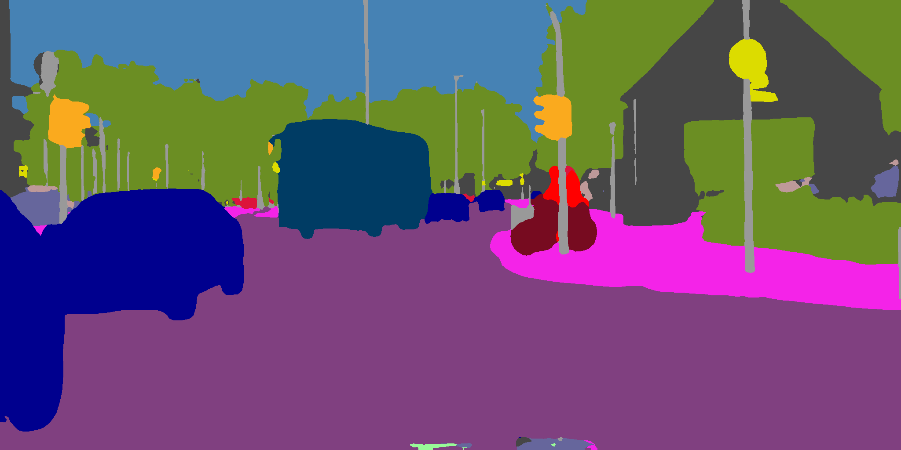
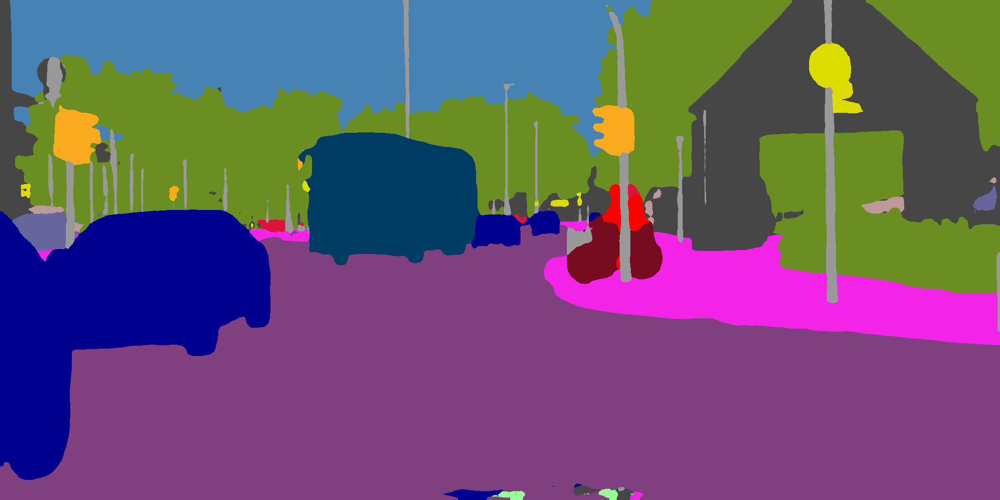

# Running a Model on a Hardware Platform #

This tutorial demonstrates the following steps:

  * Running a trained FP32 ONNX model to provide baseline results.
  * Loading, Quantizing and Compiling of the trained FP32 model.
  * Evaluation of the quantized model.
  * Benchmarking of the compiled model.
  * Executing a compiled model on a hardware platform.


## Datasets as Numpy files ##

For convenience, the calibration and validation data is provided as two numpy files - calib_dataset.npz and validation_dataset.npz.

Each file contains two numpy arrays, the 'x' array contains the images and the 'y' array contains the segmentation masks (i.e. class labels for each pixel).


## Starting the Palette SDK docker container ##

The docker container can be started by running the start.py script from the command line:

```shell
python start.py
```
When asked for the work directory, just respond with `./`


The output in the console should look something like this:

```shell
/home/projects/modelsdk_accelmode/./start.py:111: SyntaxWarning: invalid escape sequence '\P'
  docker_start_cmd = 'cmd.exe /c "start "" "C:\Program Files\Docker\Docker\Docker Desktop.exe""'
Set no_proxy to localhost,127.0.0.0
Using port 49152 for the installation.
Checking if the container is already running...
Enter work directory [/home/projects/modelsdk_accelmode]: ./
Starting the container: palettesdk_1_7_0_Palette_SDK_master_B219
Checking SiMa SDK Bridge Network...
SiMa SDK Bridge Network found.
Creating and starting the Docker container...
f72ae89b3c12494291a4b9f621f8d28f565705b8dd638fc058a79bfb5ce5e73c
Successfully copied 3.07kB to /home/projects/modelsdk_accelmode/passwd.txt
Successfully copied 3.07kB to palettesdk_1_7_0_Palette_SDK_master_B219:/etc/passwd
Successfully copied 2.56kB to /home/projects/modelsdk_accelmode/shadow.txt
Successfully copied 2.56kB to palettesdk_1_7_0_Palette_SDK_master_B219:/etc/shadow
Successfully copied 2.56kB to /home/projects/modelsdk_accelmode/group.txt
Successfully copied 2.56kB to palettesdk_1_7_0_Palette_SDK_master_B219:/etc/group
Successfully copied 3.58kB to /home/projects/modelsdk_accelmode/sudoers.txt
Successfully copied 3.58kB to palettesdk_1_7_0_Palette_SDK_master_B219:/etc/sudoers
Successfully copied 2.05kB to palettesdk_1_7_0_Palette_SDK_master_B219:/home/docker/.simaai/.port
user@f72ae89b3c12:/home$
```

Navigate into the working directory:

```shell
cd docker/sima-cli
```


## Execute Floating-Point ONNX model ##

ONNXRuntime is included in the SDK docker, so we can run the floating-point model. The run_onnx.py script includes pre- and postprocessing.


```shell
python run_onnx.py
```

*Note: the image preprocessing is assumed to be division by 255, means subtraction followed by division using the standard deviation with these values:*

```python
scale = np.array([255.0,255.0,255.0], dtype=np.float32)
means = np.array([0.485,0.456,0.406], dtype=np.float32)
std_dev = np.array([0.229,0.224,0.225],dtype=np.float32)
```

The images are written into build/onnx_pred folder:





The expected console output is like this:

```shell
--------------------------------------------------
3.10.12 (main, May 15 2025, 05:38:06) [GCC 11.4.0]
--------------------------------------------------
Pixel matching accuracy: 95.33%
```


## Quantize & Compile ##

The run_modelsdk.py script will do the following:

* unpack the numpy file containing training data and build a list of preprocessed calibration data images.
* load the floating-point ONNX model.
* quantize using calibration data and quantization parameters set using command line arguments.
* unpack the numpy file containing validation data and then test the quantized model accuracy using pre-processed images.
* compile and then untar to extract the .lm and .json files (for use in benchmarking on the target board)

*Note: the quantization is done using default configuration, better results may be obtained with a different configuration.*


```shell
python run_modelsdk.py -e
```

The images are written into build/quant_pred folder:





The expected console output is like this:

```shell
--------------------------------------------------
Model SDK version 1.7.0
3.10.12 (main, Aug  6 2025, 18:09:36) [GCC 11.4.0]
--------------------------------------------------
Results will be written to build/segmenter
Model inputs:
 input_  (1, 3, 1024, 2048)
Loaded model from segmenter.onnx
Quantizing with 5 calibration samples
Calibration Progress: |██████████████████████████████| 100.0% 5|5 Complete.  5/5
Running Calibration ...DONE
Running quantization ...DONE
Pixel matching accuracy: 95.27%
Compiling with batch size set to 1
Wrote compiled model to build/segmenter/segmenter_mpk.tar.gz
```


## Test model on hardware ##

Run the model directly on the target board. This requires the target board to be reachable via ssh. Make sure to set the IP address, password and user name of the target board:


```shell
python run_hardware.py -hn <target_ip_address>
```


The images are written into build/accel_pred folder:


The output in the console will be something like this:


```shell
--------------------------------------------------
Model SDK version 1.7.0
3.10.12 (main, Aug  6 2025, 18:09:36) [GCC 11.4.0]
--------------------------------------------------
Loading segmenter quantized model from build/segmenter
Executing quantized model in accelerator mode...
Compiling model segmenter to .elf file
Creating the Forwarding from host
Copying the model files to DevKit
Creating the Forwarding from host
ZMQ Connection successful.
Executing model graph in accelerator mode:
Progress: |██████████████████████████████| 100.0% 5|5 Complete.  5/5
Model is executed in accelerator mode.
Pixel matching accuracy: 95.27%
```


## Benchmarking model on hardware ##

The model can be benchmarked on the target board:


```shell
python ./get_fps/network_eval/network_eval.py \
    --model_file_path   ./build/segmenter/segmenter_stage1_mla.elf \
    --mpk_json_path     ./build/segmenter/segmenter_mpk.json \
    --dv_host           192.168.1.20 \
    --image_size        1024 2048 3 \
    --verbose \
    --bypass_tunnel \
    --max_frames        100 \
    --batch_size        1
```

  The measured frame rate will be printed in the console:

```shell
Running model in MLA-only mode
Copying the model files to DevKit
sima@192.168.1.20's password: 
FPS = 92
FPS = 93
FPS = 93
FPS = 93
FPS = 93
FPS = 93
FPS = 93
FPS = 93
FPS = 93
FPS = 93
Ran 100 frame(s)
```


### Files Used ###

* .gitignore - list of files to exclude from versioning.
* start.py, stop.py - start & stop SDk docker.
* config.py - configurations and common functions.
* run_onnx.py - execute the floating-point ONNX model, write predictions to PNG files.
* run_modelsdk.py - quantize, evaluate the quantized model and write predictions to PNG files, compile.
* run_hardware.py - run model on devkit and write predictions to PNG files.
* calib_dataset.npz - images and masks from the training dataset used in calibration
* validation_dataset.npz - images and masks from the validation dataset
* get_fps - folder with scripts for executing benchmarking


### Contact ###

* Mark Harvey (mark.harvey@sima.ai)

